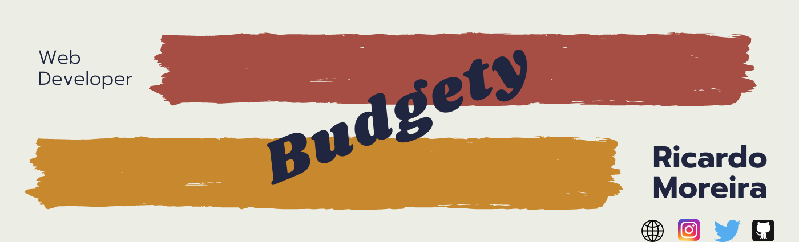
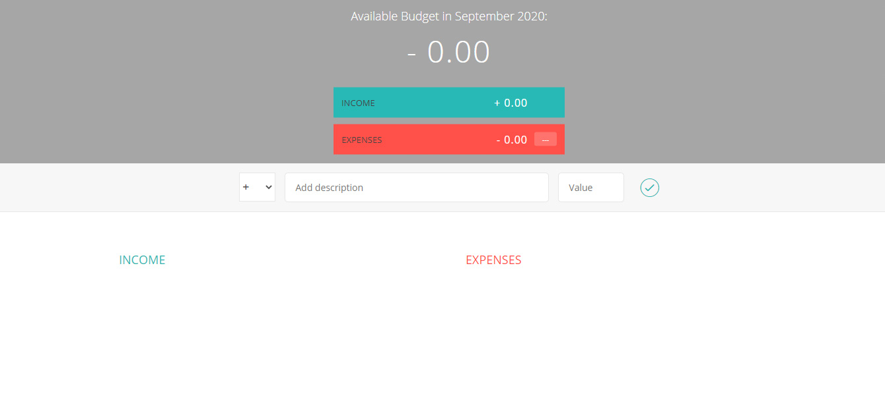
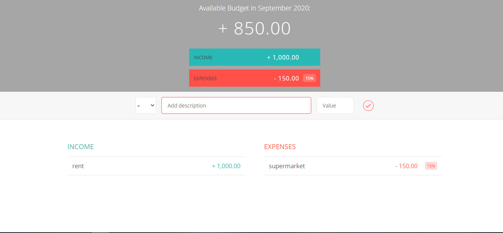

<h1 align="center"> 🔥Budget App🔥</h1>

<h2 align="center"> A budget app made only with JS </h2>

### Index

* [Name](#Name) 👈
* [Links](#Links) 🔗
* [Description](#Description) 📖
* [Languages and Frameworks](####Languages-and-Frameworks) ⚙️
* [Screenshots](#Screenshots) 📱
* [Instalation](#Instalation) 🧩
* [Support](#Support) 🆘
* [Roadmap](#Roadmap) 🗺️
* [Authors and acknowledgment](####Authors-and-acknowledgment) ✍️
* [Project Status](#Project-Status) 📜

# Name

Budget App

# Links

[Website](https://budgetfy.netlify.app/)

___

# Description

Another tutorial from [The Complete Javascript course 2018](https://www.udemy.com/the-complete-javascript-course/).

It was a tutorial with a lot to take in that I will use in the future in a app I am developing

* **Event handler**
* **Data input**
* **IIFE**
* **Closures**
* **Module**
* **DOM Manipulation**
* **Keyword this**
* **Templates**

___

# Languages, Frameworks and others

* **Javascript** - Language
* **CSS** - Styling

____

# Screenshots

Home Page         |  Blog Page
:-------------------------:|:-------------------------:
  |  

____

# Instalation

___

# Support

Have any question or find something that doesn't look good? Let's talk 😊

[Here](https://github.com/mugas)

[And Here](https://www.ricardomoreira.io/about)

____

# Roadmap

Done for now

____

# Authors-and-acknowledgment

* [Tutorial](https://www.udemy.com/the-complete-javascript-course/)

____

# Project-Status  

Done

____
